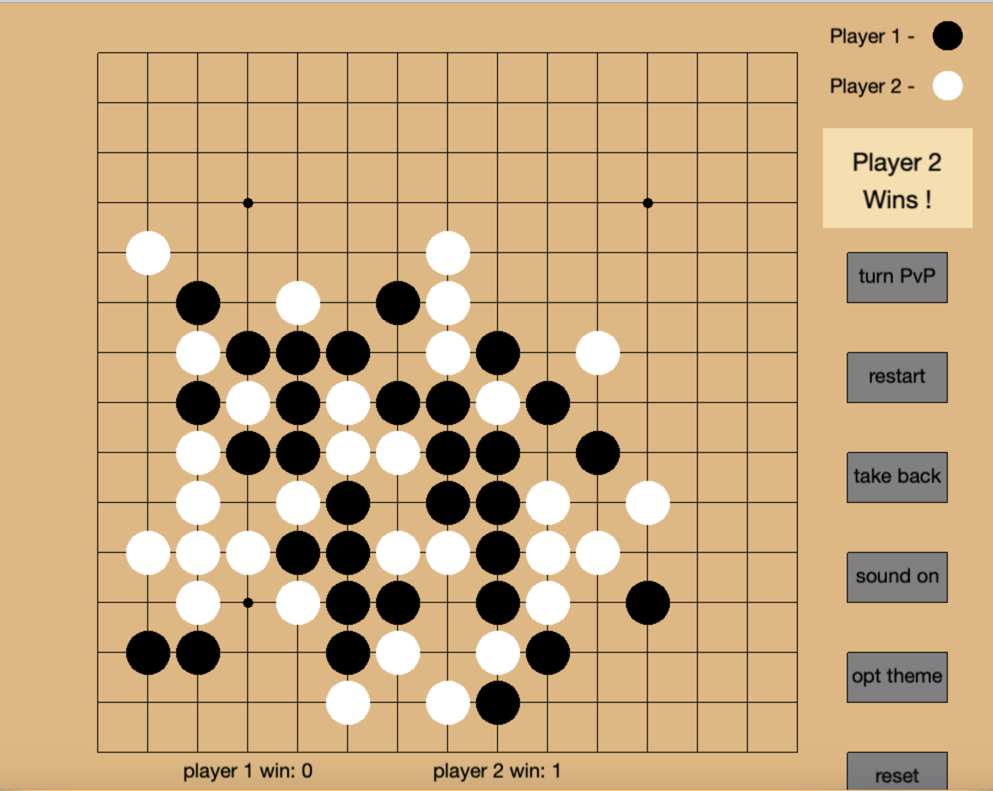
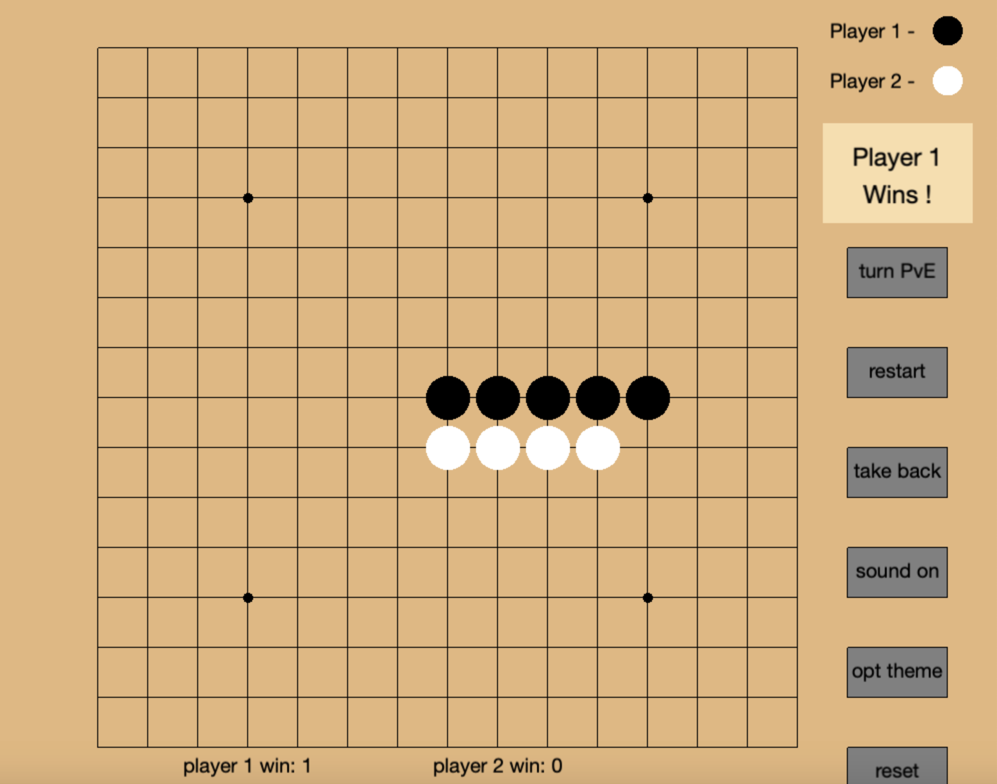
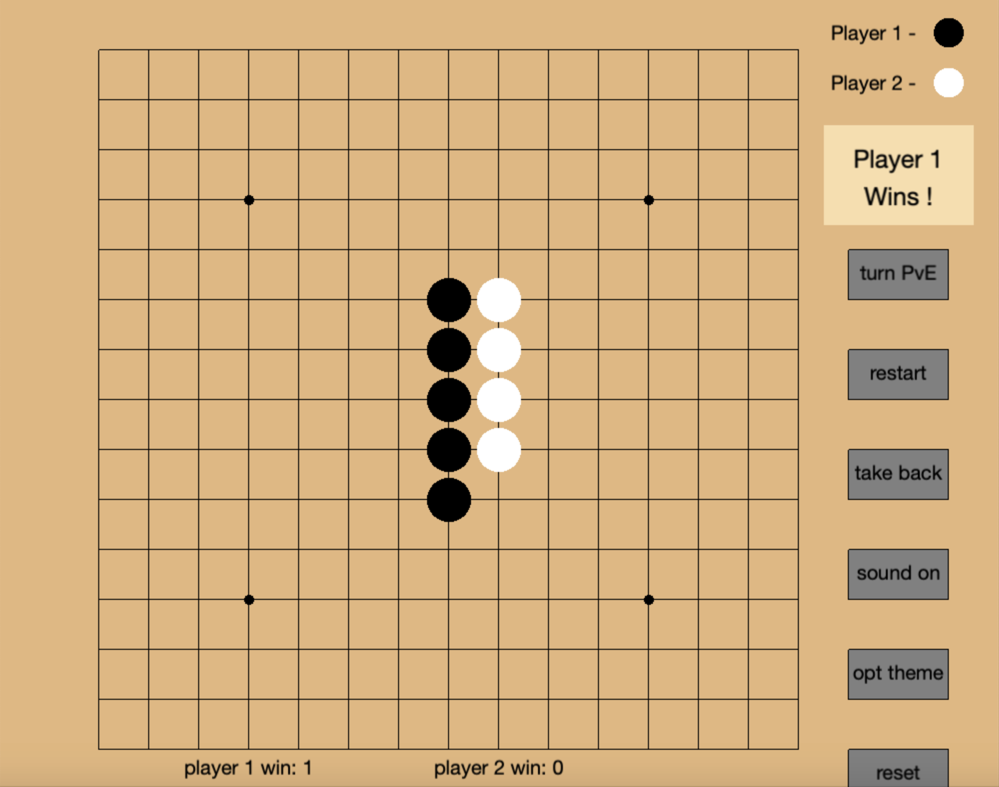
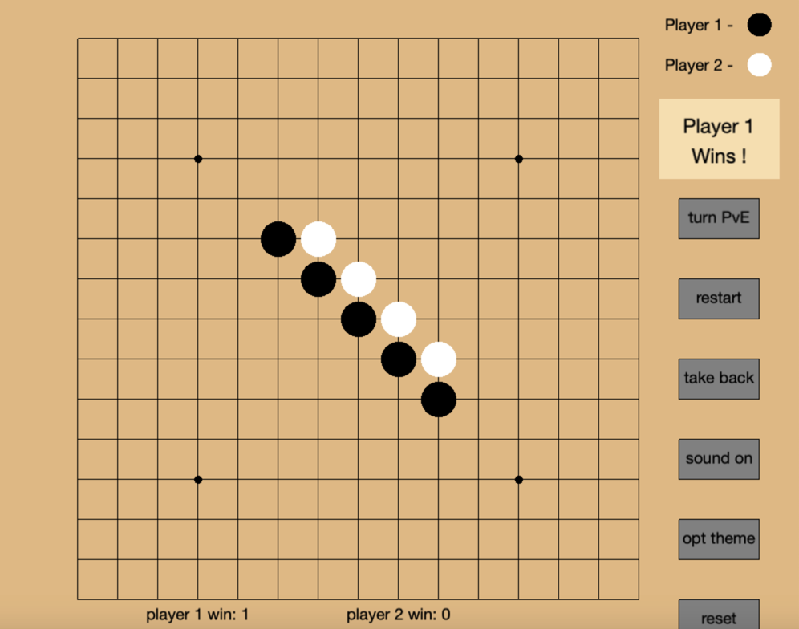
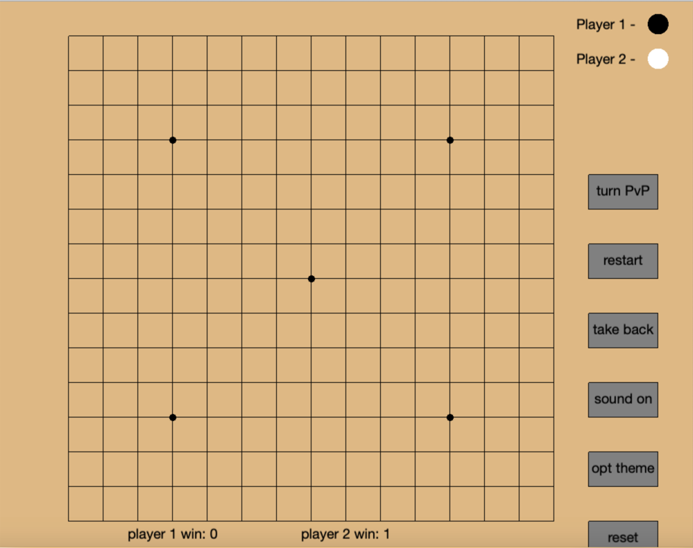
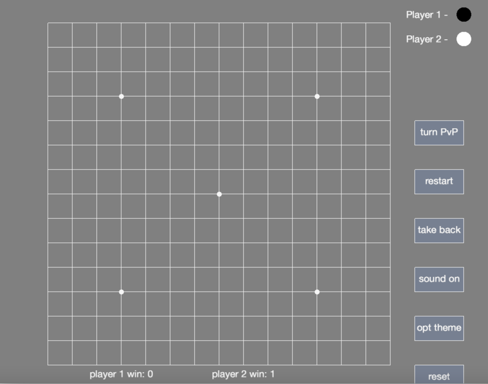
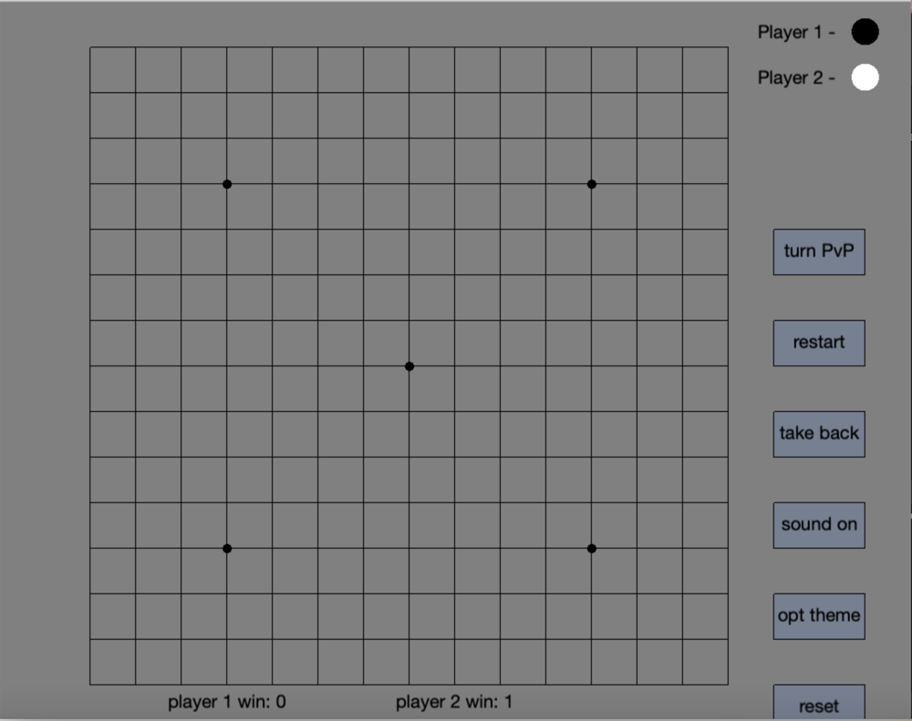
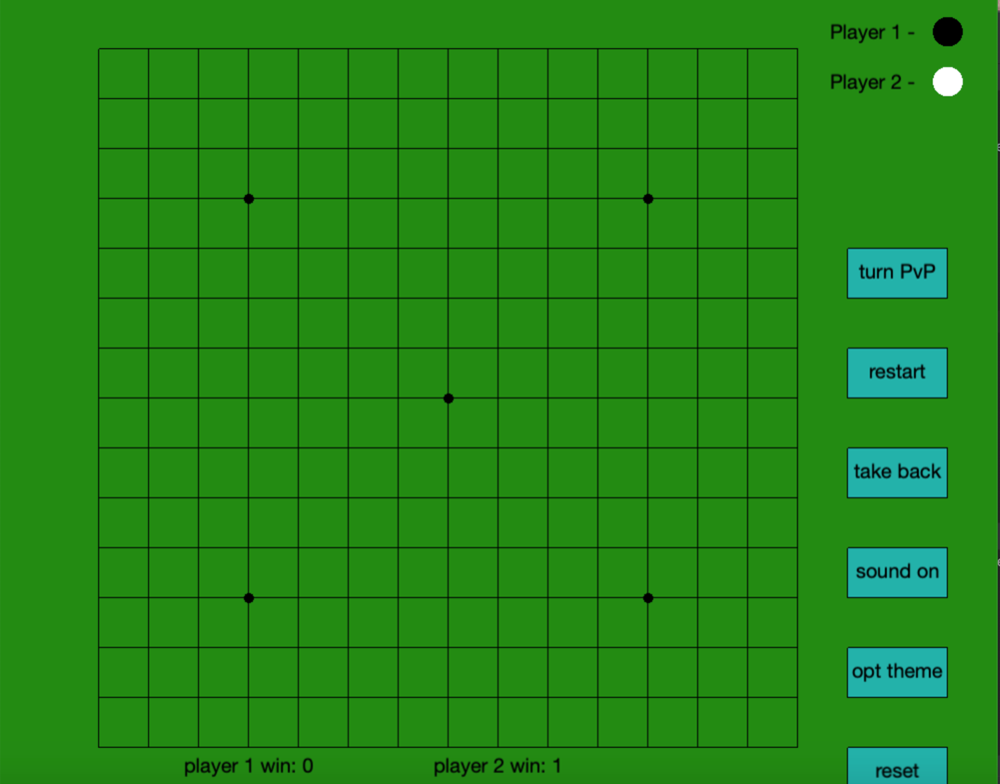
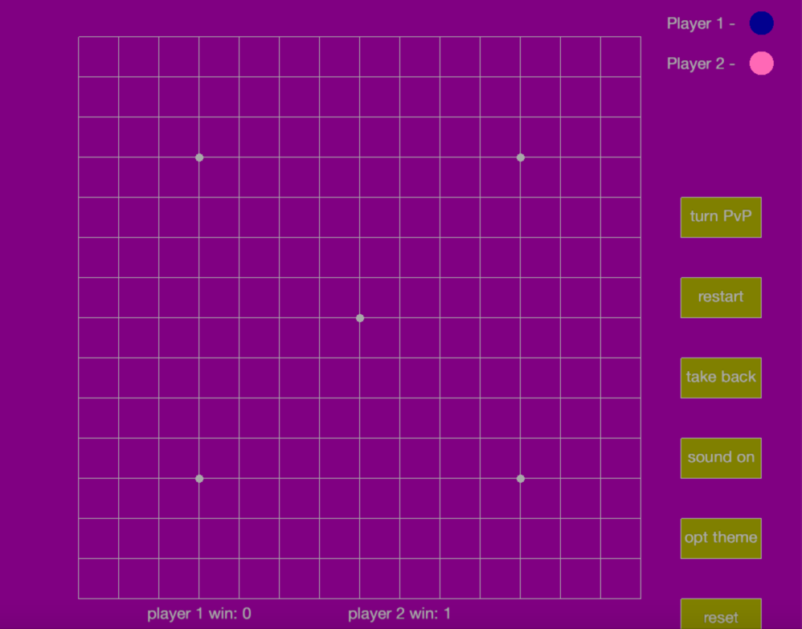

# Gomoku (Five In a Row)
Author: Yucheng Feng

## Overview
This is a Gomoku chess game, which also known as chess game Five In a Row. 
My game is implemented by C++ and is helped by Cinder library. My game has two modes: 
Player vs Player and Player vs Computer. Feel free to play with your friends and try to beat AI environment!

## Game rules
Gomoku is a strategy chess game. There are two players in the game, and you 
can see the color of your chess from right up side of the user interface.
Players take turns to player on the intersection of the straight line and horizontal
line of chess board.

To win the game, player who consists 5 sub-links on row, column, or diagonal will be the winner.

Below are three simple examples for winner cases:

## Button usage
There are six buttons on the right side of chess board. You can see roles for different buttons below.

### turn PvE (turn PvP)
This button will change game mode. If you click once, it will go to player vs computer mode.
You can change back to player vs player mode by clicking button again.

### restart
This button will restart the game. You can click it when you want a new game.

### take back
This button is designed to make regret when you want to undo one step. You can click it to revert to previous step.

### sound on (sound off)
My game includes music. You can turn on and turn off the music by clicking this button.

### opt theme
You can change to different themes using this button. Below is the board overview for different color themes.

#### Different theme color

### reset

The game history will be counted in the text at the bottom. If you want reset the game history, simply click this button.

## How to set it up and run

Make sure you have Cinder environment built in your computer. You can download Cinder library from [here](https://libcinder.org/download).

After installing the Cinder, open the ~/Cinder folder in CLion and click the green build button. You only need to do this once per machine. 

Put this project file into the directory of Cinder. Then you can open ~/apps folder and **run** the file: cinder_app_main.cc

Enjoy your game!